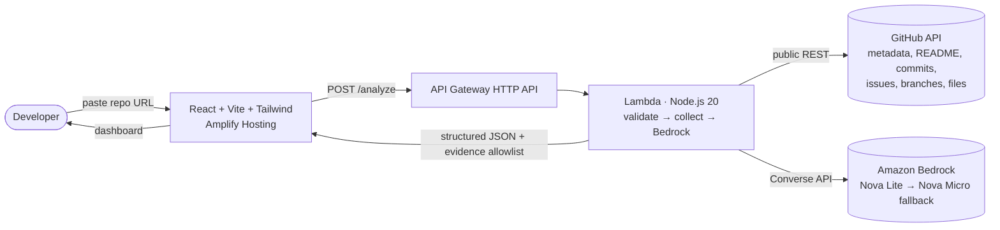

# RepoCall — Remember where your code left off

> **Recover the context behind unfinished projects in minutes.**

RepoCall is an AI-powered **developer context-recovery agent**. Paste a public GitHub repository URL and it answers: *what was I doing here, where did I stop, and what should I do next?* — grounded in real repository evidence (commits, issues, files, README), analyzed by **Amazon Bedrock**, and rendered as a developer dashboard.

Built for the **AWS Zero to Shipped** hackathon.

- **Live demo:** http://repocall-frontend-678503489298.s3-website.us-east-1.amazonaws.com/
- **API:** https://j5n58xfskf.execute-api.us-east-1.amazonaws.com
- **Repository:** <https://github.com/minhazexo/repo-call>

## Problem

Developers abandon and revisit repositories constantly — side projects, hackathon entries, work handoffs. Returning means re-reading the README, scrolling commit history, triaging stale issues, and guessing what to do next. That context recovery is slow, boring, and error-prone.

## Solution

RepoCall reconstructs your working context automatically:

1. You paste a **public GitHub repository URL** and click **Recover Context**.
2. The backend collects multi-signal evidence (metadata, README, recent commits, open issues, branches, key source/config files — with strict size limits).
3. **Amazon Bedrock (Nova Lite, Converse API)** reasons over that evidence and returns structured context: goal, current state, completed work, stopping point, blockers, risks, next 3 actions, and a *Resume in 5 Minutes* briefing.
4. Every important conclusion is linked to the **real GitHub source** that supports it.

This is **not a README summarizer** — it weighs recent commits, unresolved issues, and current source/config over old documentation, and says **“Insufficient evidence”** instead of guessing.

## Features

- Landing page with repo URL input + one-click demo repositories
- Developer dashboard: overview, context recovery, blockers, risks, next 3 actions, resume briefing, evidence grid
- Loading skeletons, invalid-URL / not-found / rate-limit / Bedrock-error / API-error states
- `localStorage` persistence of the latest analysis + “Analyze Again”
- Evidence allowlist: the model may only cite backend-supplied GitHub URLs (invented URLs are dropped server-side)
- Untrusted-data framing: repo content can never override agent instructions; repo code is never executed
- Bounded GitHub collection (ignores `node_modules`, `dist`, lockfiles, binaries; caps files/bytes)
- Optional `GITHUB_TOKEN` for 5,000/hr rate limits (works anonymously at 60/hr)

## Architecture



### AWS services

| Service | Use |
|---|---|
| Lambda | API handler (validate → GitHub collect → Bedrock) |
| API Gateway HTTP API | `GET /health`, `POST /analyze`, CORS |
| IAM | Least-privilege Bedrock `InvokeModel*` on the two Nova models |
| CloudWatch Logs | 1-week retention Lambda logs |
| Amplify Hosting | Public frontend (React/Vite/Tailwind) |
| Bedrock (Nova Lite → Nova Micro fallback) | Context-recovery reasoning via Converse API |

### Repository layout

```text
apps/web    React + TypeScript + Vite + Tailwind frontend
apps/api    Node.js + TypeScript Lambda API (Bedrock Converse, GitHub collector)
infra       AWS CDK stack (HTTP API, Lambda, IAM, logs)
docs        hackathon.md, aws-agent-evidence.md
scripts     deploy-backend.ps1 (guided AWS deploy + verify)
amplify.yml Amplify Hosting build config
```

## Bedrock usage

- **Models:** `amazon.nova-lite-v1:0` (primary) → `amazon.nova-micro-v1:0` (automatic fallback), `us-east-1`.
- **API:** Bedrock **Converse API** (`ConverseCommand`), `maxTokens: 2500`, `temperature: 0.2`.
- **System prompt** (`apps/api/src/lib/bedrock.ts`): instructs the model it is a context-recovery agent (not a summarizer), to use only supplied evidence, to prioritize recent signals, to cite only catalog URLs, to say “Insufficient evidence” when appropriate, and to return **strict JSON only**.
- **Agent workflow:** validate URL → collect bounded evidence package + evidence-source allowlist → build framed prompt (repo content wrapped as `<repository-evidence>` untrusted data) → Converse (primary, then fallback) → strip fences → `JSON.parse` → schema validation + URL-allowlist filtering → dashboard.
- **Anti-hallucination:** any `evidence[].sourceUrl` not in the backend allowlist is dropped; malformed/empty model output becomes an honest `BEDROCK_ERROR`, never fake content.

## Security

- No AWS credentials in the browser — the frontend only calls the HTTP API; Bedrock is invoked server-side under an IAM role.
- IAM least privilege: only `bedrock:InvokeModel*` on the two Nova foundation-model ARNs.
- Server-side URL validation (github.com owner/repo only), 10 KB request body limit.
- Downloaded repository code is treated as data and never executed; prompt-injection framing in the system prompt.
- CORS configured on the HTTP API; no secrets logged (Bedrock errors are redacted before reaching the client).
- GitHub rate limits handled explicitly (`429` + `Retry-After`); optional `GITHUB_TOKEN` supported.

## Local development

Prerequisites: Node.js 20+, npm.

```powershell
npm install

# Backend (http://localhost:4000) — copy .env.example to .env first for Bedrock config
npm run dev --workspace=apps/api

# Frontend (http://localhost:5173, proxies /api to :4000)
npm run dev --workspace=apps/web

# Quality gates
npm run typecheck   # all workspaces
npm run lint        # eslint, zero warnings
npm run test        # backend vitest suite
npm run synth --workspace=infra  # CDK synth (no AWS credentials needed)
```

Local Bedrock: the API needs AWS credentials with `bedrock:InvokeModel` (e.g. `aws configure`) unless you set `ENABLE_HEURISTIC_FALLBACK=true` in `apps/api/.env` for UI development (clearly labelled non-AI output, never enabled in production).

## Deployment

### 1. Enable Bedrock model access (console, one-time)

AWS Console → Amazon Bedrock → Model access → enable **Nova Lite** and **Nova Micro** in `us-east-1`.

### 2. Backend (CDK)

```powershell
aws configure                    # access key with CloudFormation/Lambda/APIGW/IAM/Logs rights
$env:AWS_REGION = "us-east-1"
# optional: $env:GITHUB_TOKEN = "ghp_..."
powershell -ExecutionPolicy Bypass -File ./scripts/deploy-backend.ps1
```

Note the `ApiUrl` output — e.g. `https://abc123.execute-api.us-east-1.amazonaws.com/`.

### 3. Frontend (Amplify Hosting)

1. Push this repo to GitHub.
2. AWS Console → Amplify → New app → Host web app → connect `minhazexo/repo-call`.
3. Build settings: `amplify.yml` is auto-detected.
4. Environment variable: `VITE_API_BASE_URL` = your `ApiUrl` (no trailing slash).
5. Deploy → you get a public `https://….amplifyapp.com` URL. Redeploy triggers on every push.

### 4. Post-deploy verification

```powershell
$Api = "<ApiUrl>"
Invoke-RestMethod "$Api/health"
Invoke-RestMethod "$Api/analyze" -Method Post -ContentType "application/json" `
  -Body '{"repositoryUrl":"https://github.com/axios/axios"}' -TimeoutSec 180
```

Then: open the Amplify URL, run a real analysis, check evidence links, browser console (no errors), and CloudWatch logs (`/aws/lambda/RepoCallStack-AnalyzeFunction…`). See `docs/aws-agent-evidence.md` for the full checklist and screenshot list.

## Limitations

- Public repositories only (no auth, no private repos).
- GitHub API rate limits apply (60/hr anonymous, 5,000/hr with token).
- Large repositories are sampled (20 commits, 20 issues, 12 files, ~120 KB) — the dashboard notes when context was truncated.
- Bedrock output is probabilistic; the evidence allowlist keeps it grounded but conclusions should still be spot-checked via the linked sources.
- Analysis can take 30–90s (GitHub collection + LLM reasoning).

## Future roadmap

- Authenticated GitHub + private repo support (OAuth)
- Deeper signals: PRs, CI status, diffs, blame recency
- Analysis history + comparison (“what changed since last visit”)
- Streaming progress (SSE) instead of one long request
- Multi-repo workspace recovery (“what was I doing across all my repos?”)

## Screenshots

`<!-- TODO: add screenshots — see docs/aws-agent-evidence.md for the exact capture list -->`

1. Landing page (`docs/screenshots/01-landing.png`)
2. Loading skeleton (`docs/screenshots/02-loading.png`)
3. Dashboard — overview + resume briefing (`docs/screenshots/03-dashboard.png`)
4. Blockers / next actions / evidence (`docs/screenshots/04-evidence.png`)
5. Health check + real analysis terminal output (`docs/screenshots/05-api-proof.png`)
6. Amplify + Bedrock console proof (`docs/screenshots/06-aws-console.png`)
